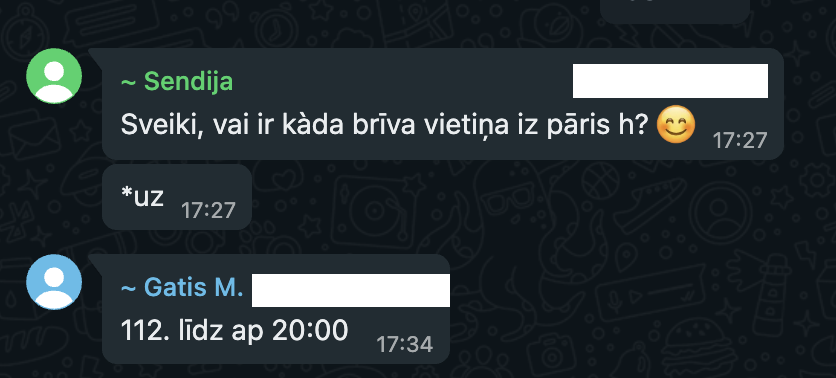
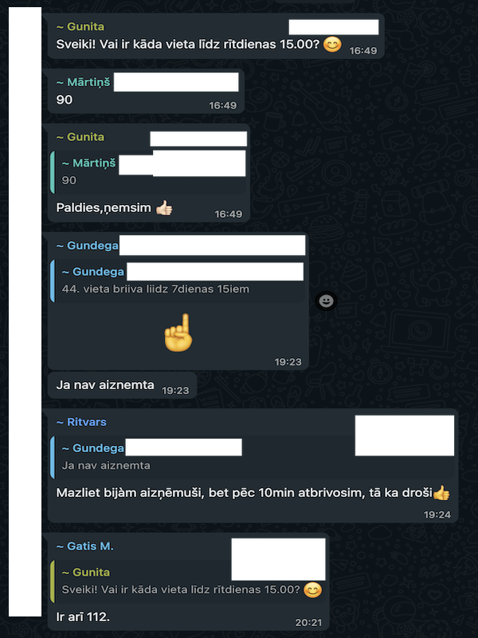

# Roof Mate

---
## Why & About

- I live in small area where's a limited amount of parking spots
- People are quite friendly and try to share their spots while not in use
- They use WhatsApp to share & produce a lot of unmanaged spam

--- 


--- 


---


---
## Problems 

- People need spots
- Shared spots are lost in message history
- Some might share a spot for couple of days
- Some might need only few hours
- Need to find contact info spots is not empty as agreed previously in WhatsApp

---
## Roof Mate REST API

- basic CRUD app
- register with name & phone
- share your spot with exact times
- observe free spots with available time intervals & book

---
## Tech Stack

### Backend
- cats, cats-effect
- http4s, circe, doobie, pure-config

### UI
- scala.js, laminar, laminext
- java -> js: macrotaskexecutor, java.time

### Test
- scalatest, scalacheck

---
## Project structure

- multi module SBT project
- common
    - cross compiles domain models to JS / JVM
- backend / frontend
    - depends on common
- docker compose for local development
- fly.io for production

---
# Show case

---

# Most interesting parts

---
## Interval

Custom syntax for working with _java.time.Instant_ (mostly for testing)

```scala
  it should "check overlapping" in {
    val scenarios = Table(
      ("a", "b", "overlaps"),
      
      // [---]
      //  [---]
      (0.h -> 1.h, 30.m -> (1.h + 30.m), true),
      
      // [---]
      //  [-]
      (0.h -> (1.h + 30.m), 30.m -> 1.h, true),
      
      // [-]
      //    [-]
      (0.h -> 30.m, 1.h -> (1.h + 30.m), false),
    )

    forAll(scenarios) { _ overlaps _ shouldBe _ }
  }
```

---

Function to split interval into multiple free intervals

```scala
  it should "cut out interval" in {
    val interval = 0.h -> 10.h
    val busy = 1.h -> 2.h

    interval.cut[ErrOr](busy).value should contain theSameElementsAs
      Set(0.h -> 1.h, 2.h -> 10.h)
  }
```

--- 

```scala
  it should "cut out all intervals" in {
    val scenarios = Table(
      ("interval", "busy", "free"),
      (0.h -> 10.h, List(0.h -> 10.h), Set.empty[Interval]),
      (0.h -> 10.h, List(0.h -> 2.h, 2.h -> 4.h, 4.h -> 5.h), Set(5.h -> 10.h)),
      (
        0.h -> 3.d,
        List(10.m -> (2.d + 23.h), (2.d + 23.h + 30.m) -> (2.d + 23.h + 59.m)),
        Set(0.m -> 10.m, (2.d + 23.h) -> (2.d + 23.h + 30.m), (2.d + 23.h + 59.m) -> 3.d),
      ),
      (
        0.h -> 3.d,
        List(10.m -> (2.d + 23.h), (2.d + 23.h + 10.m) -> (2.d + 23.h + 59.m)),
        Set(0.m -> 10.m, (2.d + 23.h + 59.m) -> 3.d),
      )
    )

    forAll(scenarios) { (interval, busy, free) =>
      interval.cutAll[ErrOr](busy).value should contain theSameElementsAs free
    }
  }
```

---
## Error handling middleware

```scala
  def withAPIError(service: HttpRoutes[IO]): HttpRoutes[IO] = {
    import org.http4s.circe.CirceEntityCodec.circeEntityEncoder

    implicit val encoder: Encoder[APIError] = deriveEncoder

    Kleisli { request =>
      service
        .run(request)
        .handleErrorWith(e => OptionT.liftF(BadRequest(APIError(e.getMessage))))
    }
  }
```

---

```scala
  private def spots(service: SpotService[IO]): HttpRoutes[IO] = {
    HttpRoutes.of[IO] {
      case GET -> Root / "spots" =>
        service
          .sharedSpots()
          .flatMap(Ok(_))

      case request @ POST -> Root / "spots" =>
        request
          .as[SpotCreate]
          .flatMap(service.create)
          .flatMap(Created(_))
    }
  }
```

---
## UI (just experiment - incomplete)


```scala
object Field {
  def apply(labelText: String, value: Observer[String]): Element = {
    div(
      cls := "field",
      label(labelText, cls := "label"),
      div(
        cls := "control",
        input(cls := "input", typ := "text", placeholder := labelText, onInput.mapToValue --> value)
      )
    )
  }
}
```

---

```scala
object CreateSpot {
  def apply(user: User, commands: Observer[AppCommand]): Element = {
    val spot = Var(initial = SpotCreate("", user.id))
    val identifier = spot.updater[String]((spot, identifier) => spot.copy(identifier = identifier))

    def create: EventStream[AppCommand] = {
      Fetch
        .post("api/spots", body = jsonRequestBody(spot.now()))
        .decode[Spot]
        .map(it => SpotCreated(it.data))
    }

    div(
      cls := "column",
      h3(cls := "title is-3", "Create spot"),
      Field("Spot identifier", identifier),
      div(
        cls := "field is-grouped",
        div(
          cls := "control",
          button(cls := "button is-link", "Create", onClick.flatMapStream { _ => create } --> commands)
        )
      )
    )
  }
}
```

--- 

## That's it!

- Github Repo - https://github.com/sashjakk/roof-mate
- Fly.io UI - https://roof-mate.fly.dev/
- Fly.io REST - https://roof-mate.fly.dev/api